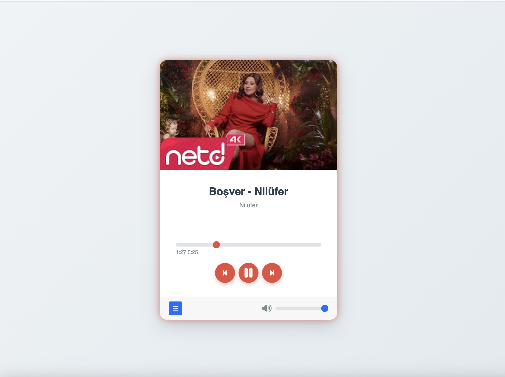
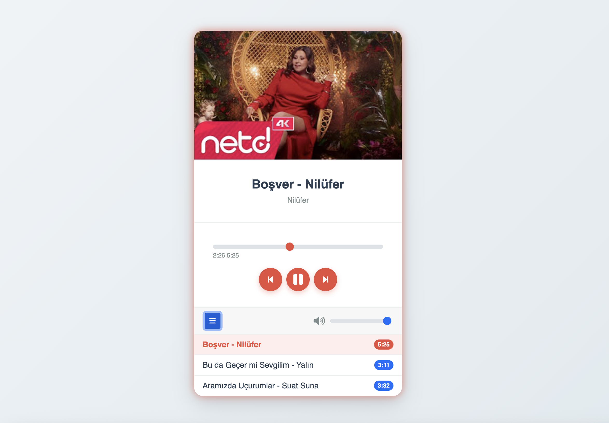

# 🎵 Web Music Player

Bu proje, **HTML, CSS ve JavaScript (ES6)** kullanılarak geliştirilmiş modern ve kullanıcı dostu bir müzik çalar uygulamasıdır. Bootstrap 5 ile responsive bir yapıya sahiptir.

## 📸 Ekran Görüntüleri

| Ana Ekran | Şarkı Listesi |
|-----------|---------------|
|  |  |

## ✨ Özellikler

* **Oynatma Kontrolleri:** Oynat, Duraklat, Önceki ve Sonraki şarkı geçişleri.
* **İlerleme Çubuğu:** Şarkının anlık süresini görme ve istenilen saniyeye sarma özelliği.
* **Ses Kontrolü:** Ses seviyesini ayarlama ve tek tıkla sessize alma (mute).
* **Dinamik Şarkı Listesi:** Sağ alttaki menü butonu ile açılıp kapanabilen şarkı listesi.
* **Otomatik Geçiş:** Şarkı bittiğinde otomatik olarak sıradaki parçaya geçiş.
* **Metadata Okuma:** Yüklenen şarkıların sürelerini otomatik hesaplama.

## 🛠️ Kullanılan Teknolojiler

* **HTML5**
* **CSS3** (Custom Properties & Animations)
* **JavaScript** (OOP - Class Yapısı)
* **Bootstrap 5.1.3**
* **FontAwesome** (İkonlar için)

## 📂 Dosya Yapısı

* `index.html`: Ana sayfa yapısı.
* `style.css`: Özelleştirilmiş tasarımlar ve renk paleti.
* `app.js`: DOM manipülasyonu ve olay dinleyicileri.
* `music.js`: Şarkı veri modeli (Class).
* `musicplayer.js`: Oynatıcı mantığı ve kontrol sınıfı.
